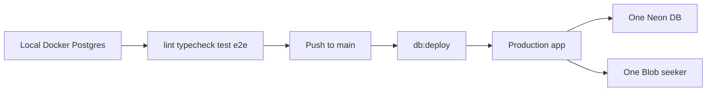

# Runbook: Deploy

## Architecture (small setup)

One Vercel project, **one Neon database**, **one Blob store**. Default workflow is **main-only**: code and deploy from `main` (no feature-branch / preview DB isolation).

| Layer | What |
|-------|------|
| **Local** | `pnpm dev` + Docker Postgres — where you test migrations and e2e **before** pushing |
| **Production** | Deploy from `main`. Runs `pnpm db:deploy` then `pnpm build`. |

PR preview deploys are optional and unused in the main-only workflow. If a preview ever exists, it shares the same Neon DB + Blob and does **not** run migrations.



GitHub Actions CI uses a throwaway Postgres service container (not Neon).

## One-time setup

1. **Vercel**: import `omvineet/kindle-life`.
2. **Neon via Vercel Marketplace**: connect to the project. Prefer **Production** (and Preview if you want preview `/api/health` to hit the DB).
   - **Turn off** “Automatically create a branch for each preview deployment” if it is on. Preview branching burns Neon free-tier limits and is not used here.
   - One `DATABASE_URL` for the primary database is enough. Preview may share that same URL.
3. **Vercel Blob**: public store `seeker` (already provisioned). See `docs/runbooks/storage.md`.
4. **GitHub branch protection** on `main`: require CI checks.

## Everyday flow

1. Develop and test locally (`docker compose up -d`, `pnpm db:migrate` / `pnpm db:deploy`, `pnpm lint && pnpm typecheck && pnpm test`, e2e as needed).
2. Push to `main` → Vercel production deploy applies pending migrations, then builds.
3. Verify: `curl https://kindle-life.vercel.app/api/health` → `{"ok":true,"db":true}`.

Optional: open a PR for review; preview apps share the one DB and skip migrate. Not required for this project.

## Migrations

- **Author and apply locally first** against Docker.
- **Production only** applies migrations on Vercel (`scripts/vercel-build.sh` checks `VERCEL_ENV=production`).
- Never edit applied migration history; fix forward with a new migration.
- Because Preview and Production share one DB: do not rely on a preview deploy to “try” a destructive schema change. Prove it locally, then merge.

## Data / limits notes

- No Neon Instant Restore / PITR extras — stay on the free defaults.
- No Neon preview-branch cleanup workflow (removed; branching is off).
- Blob is intentionally shared (one store). Game media is versioned; no Blob-per-env.

## Running e2e against a deployment

```bash
E2E_BASE_URL=https://<preview-or-prod-url> pnpm test:e2e
```

Prefer local e2e for schema-sensitive work.

## Rollback

- App: Vercel → Deployments → promote a previous production deployment (or `vercel rollback`).
- Database: forward-only. Reverse with a new migration locally, merge to `main`.

## Local database

```bash
docker compose up -d
cp .env.example .env
pnpm db:deploy
```
